# 🚀 Instalación y Configuración de WordPress

**Guía completa para desplegar WordPress con Apache y MySQL.**

## 📋 Pasos de Instalación

### 1. 📦 Instalación de Dependencias

## **Instalación de paquetes necesarios:**
- **Apache** - Servidor web
- **MySQL** - Base de datos

### 2. ⬇️ Descarga de WordPress
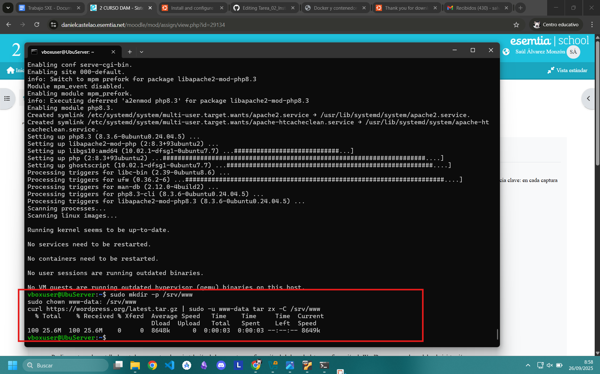
## **Descarga y extracción de archivos de WordPress en el directorio del servidor.**

### 3. ⚙️ Configuración de Apache
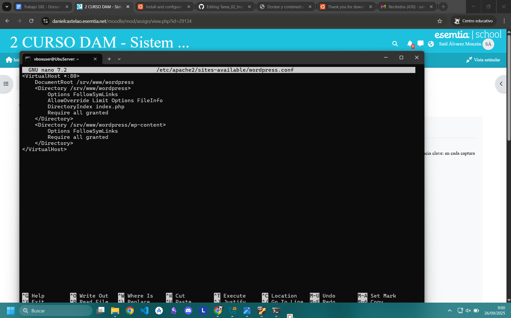
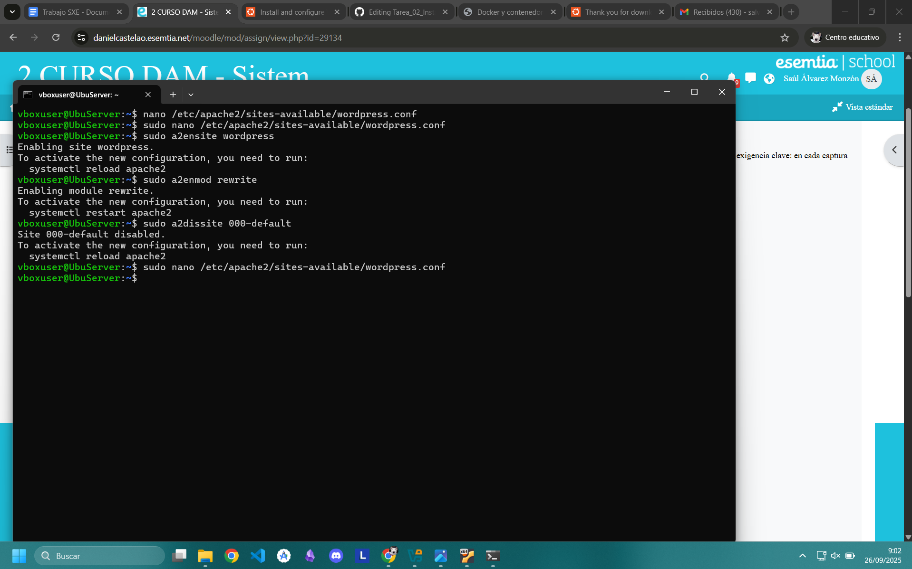
**- Creación de virtual host**
**- Habilitación del sitio**
**- Desactivación página por defecto**
**- Configuración de permisos**

### 4. 🗄️ Configuración de Base de Datos
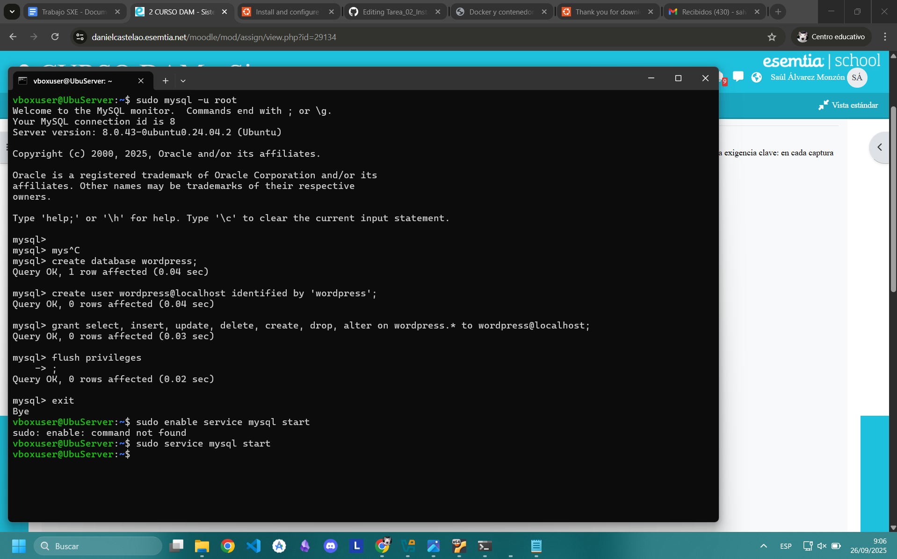
**- Creación de BD y usuario**
**- Asignación de privilegios**
**- Configuración de seguridad**

### 5. 🔗 Conexión WordPress con BD
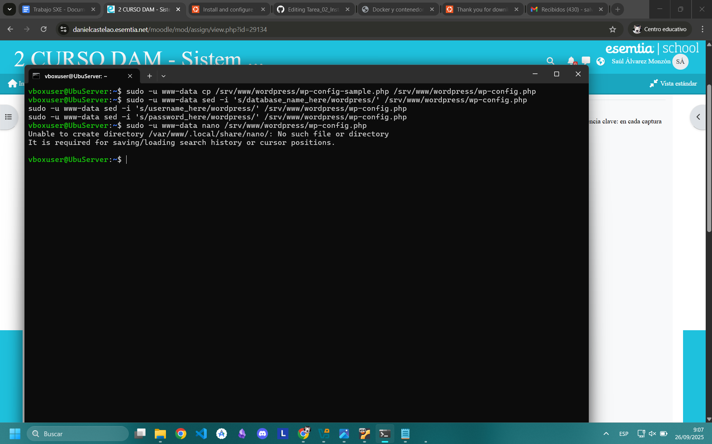
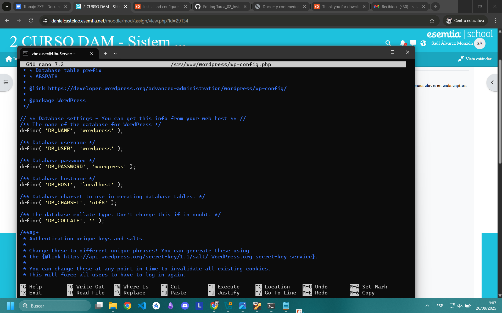
## **Configuración del archivo `wp-config.php` con datos de conexión.**

### 6. 🎯 Configuración Inicial de WordPress
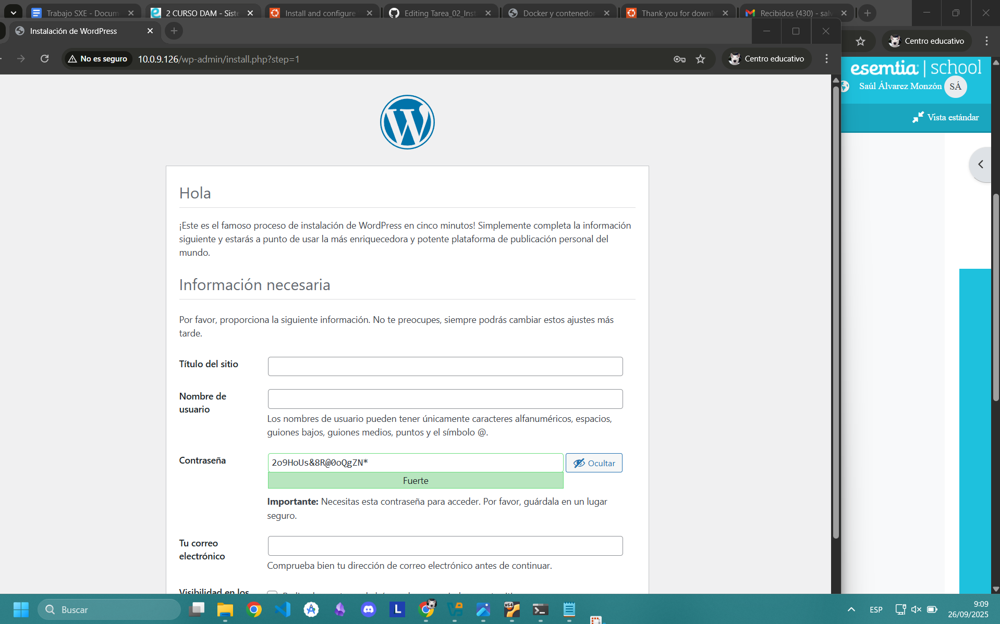
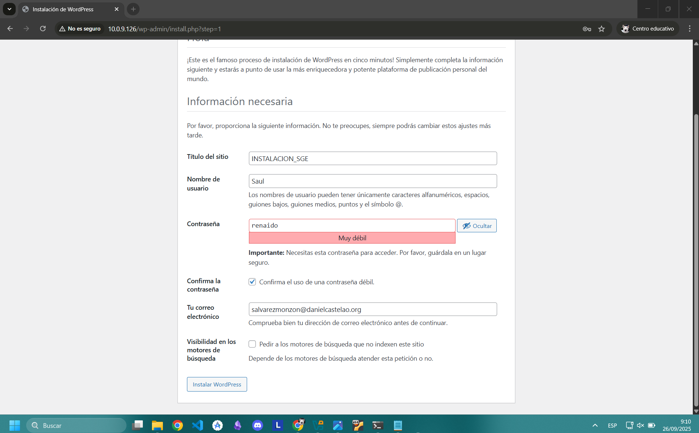
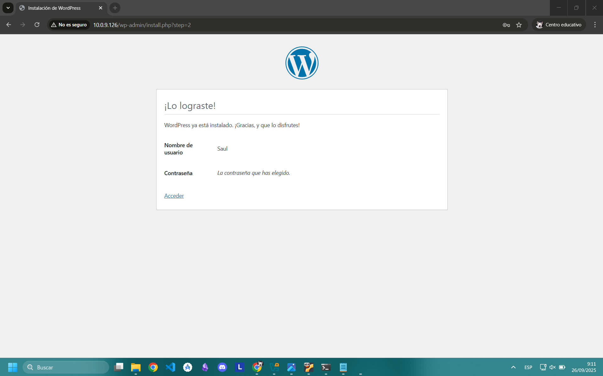
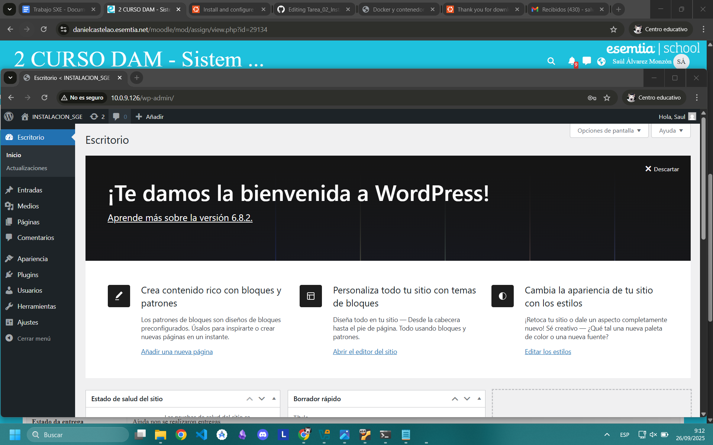
- Información del sitio
- Usuario administrador
- Ajustes básicos

### 7. 🎨 Instalación de Tema y Plugins
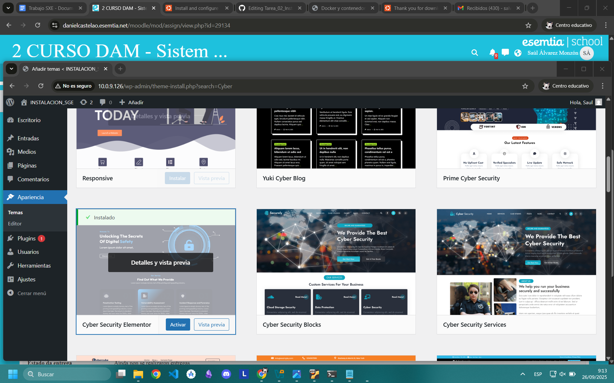
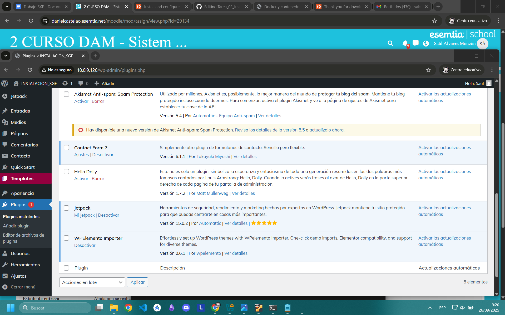

## 🔌 Plugins Instalados

### 📧 Contact Form 7
## **Función**: Crear y gestionar formularios de contacto personalizables.

### 🚀 Jetpack
## **Función**: Suite de herramientas para seguridad, rendimiento y estadísticas.

---

## 📊 Stack Tecnológico

| Componente | Versión | Uso |
|------------|---------|-----|
| WordPress | 5.8+ | CMS |
| Apache | 2.4+ | Servidor Web |
| MySQL | 8.0+ | Base de Datos |
| PHP | 7.4+ | Lenguaje |

## ✅ Estado

---
